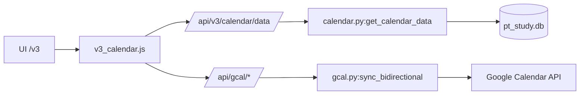

# Connectivity Map (Dashboard Rebuild)

## Calendar (v3)

| Layer | Component | Path/ID | Notes |
| --- | --- | --- | --- |
| UI | Calendar view | `/v3` | FullCalendar-based Month/Week/Day views. |
| Template | Calendar template | `dashboard_rebuild/code/templates/v3_calendar.html` | Calendar mount + layout. |
| JS | Calendar module | `dashboard_rebuild/code/static/v3_calendar.js` | Fetches calendar data + binds UI. |
| API | Calendar data | `/api/v3/calendar/data` | Aggregates local events/sessions/plans. |
| API | Google calendars | `/api/gcal/calendars` | Calendar list + selection state. |
| API | Google sync | `/api/gcal/sync` | Two-way sync (manual trigger). |
| Backend | Calendar data | `brain/dashboard/calendar.py:get_calendar_data` | Reads course_events, sessions, study_tasks. |
| Backend | Google sync | `brain/dashboard/gcal.py:sync_bidirectional` | Push/pull against Google. |
| DB | Core tables | `brain/data/pt_study.db` | `course_events`, `study_tasks`, `sessions`. |
| External | Google Calendar | `calendar.google.com` | OAuth + Google Calendar API. |

