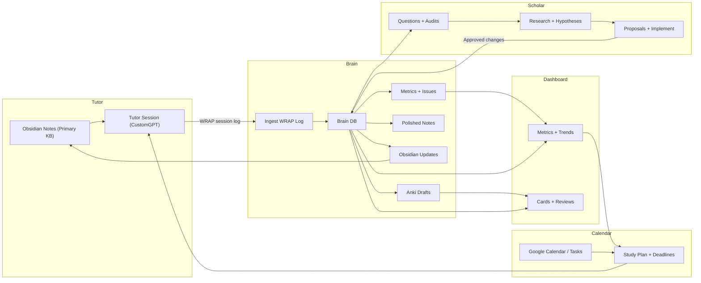

# System Map (Dashboard / Brain / Calendar / Scholar / Tutor)

> Canonical source: `docs/system_map.md`. Update that file first.

## Purpose
- Provide a single canonical map of how the five core pages interact: Dashboard, Brain, Calendar, Scholar, Tutor.
- Document the data loop from Obsidian notes → Tutor WRAP → Brain → Scholar → Dashboard/Calendar.
- Define what happens when no new study data exists (Scholar research mode).

## Pages (Dashboard / Brain / Calendar / Scholar / Tutor)
| Page | Role | Inputs | Outputs |
| --- | --- | --- | --- |
| **Dashboard** | Visual command center for metrics and status. | Brain database, Scholar summaries. | Trends, issues, readiness signals, task status. |
| **Brain** | Source of truth database + ingestion + metrics. | Tutor WRAP logs, notes, card drafts. | Metrics, issues, card drafts, polished notes. |
| **Calendar** | Schedule control for study commitments. | Google Calendar/Tasks, Brain priorities. | Planned sessions, deadlines, reminders. |
| **Scholar** | Meta-system for audits and improvement. | Brain telemetry, SOPs, study logs. | Questions, hypotheses, proposals, research. |
| **Tutor** | CustomGPT learning interface. | Obsidian notes, study prompts. | WRAP session log, study outputs, drafts. |

## System Flowchart (Mermaid)

## Core Loops
- **Study Loop:** Obsidian notes → Tutor session → WRAP log → Brain ingestion → Obsidian update + Dashboard metrics.
- **Intelligence Loop:** Brain metrics/issues → Scholar questions → research → proposals → approved changes.
- **Scheduling Loop:** Calendar/Tasks → study plan → Tutor session targets.
- **Zero-Data Mode:** If no new telemetry exists, Scholar focuses on pedagogy + meta-learning research and logs new questions/proposals.

## Data Artifacts (Canonical)
- **Session Logs:** `brain/session_logs/*.md` (Tutor WRAP output).
- **Database:** `brain/data/pt_study.db` (source of truth).
- **Card Drafts:** `card_drafts` table + Anki sync tooling.
- **Scholar Outputs:** `scholar/outputs/` (reports, questions, proposals).
- **Obsidian Notes:** `projects/treys-agent/context/` (primary knowledge base; updated by Brain after WRAP).

## Related Docs
- `[[calendar_tasks]]`

## Image Export (PNG)
- Export the Mermaid diagram to `docs/assets/system_map.png`.
- Recommended: open this file in Obsidian and use Mermaid export, or use a Mermaid CLI locally.
