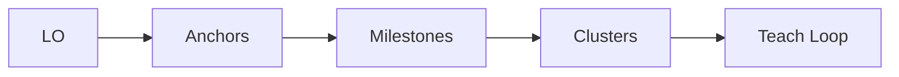

# 09 — Templates

All PEIRRO study templates in one file. Copy and fill in per session/week.

---

## 1. Session Intake

**Exposure Check:** First exposure / Review (circle one)

### Track A (First Exposure)
- Class/topic:
- Time available:
- Input materials (paste or upload):
- [ ] AI cluster map approved
- Plan from map (3-5 steps):
- Prime (brain dump; UNKNOWN is valid):
- Mode (Core/Sprint/Light/Quick Sprint/Drill):
- Method chain (optional):

### Track B (Review)
- Target exam/block:
- Time available:
- Topic scope:
- Materials (Source-Lock):
- Weak anchors to interleave:
- Plan of attack (3-5 steps):
- Pre-test (1-3 retrieval items, no hints):
- Mode (Core/Sprint/Light/Quick Sprint/Drill):
- Method chain (optional):

---

## 2. Session Log

JSON is the canonical log format (see `08-logging.md`). Use this template for quick human-readable recaps.

- Date:
- Topic:
- Mode:
- Duration (min):

**Anchors Locked:**
-

**Cards Created:**
-

**Metrics:**
- Calibration gap:
- Retrieval success rate:
- Cognitive load type:
- Transfer check:

**Exit Ticket:**
- Blurt summary:
- Muddiest point:
- Next action hook:

**Next Session** (topic + date):
-

---

## 3. LO Engine Topic Note Template

Obsidian-ready, fixed output order. Use one LO at a time.

1) LO text:
- LO:

2) Source anchors (file + slide/page/heading):
- [source]:

3) Milestone Map (3-7 milestones per LO, each with anchor):
- M1: [milestone] (anchor)
- M2: [milestone] (anchor)
- M3: [milestone] (anchor)

4) Cluster Map (3-5 clusters mapped to LO):
- C1: [cluster] -> LO [id]
- C2: [cluster] -> LO [id]
- C3: [cluster] -> LO [id]

5) Explanation per cluster (plain language):
- C1:
- C2:
- C3:

6) Mermaid diagram (big-picture spine + clusters):


7) Retrieval prompts (2-3 per cluster; free recall):
- C1:
  - Prompt 1:
  - Prompt 2:
- C2:
  - Prompt 1:
  - Prompt 2:
- C3:
  - Prompt 1:
  - Prompt 2:

8) Transfer prompt (1 per LO):
- Transfer:

9) Next micro-task (<=15 words):
- Next:

---

## 4. Exit Ticket + Session Ledger (Wrap Outputs — v9.4)

**Exit Ticket:**
- [ ] **Blurt** (2 min, notes closed) — free recall summary: _______________
- [ ] **Muddiest point** — one concept: _______________
- [ ] **Next action hook** — first action next session: _______________

**Session Ledger:**
- session_date: _______________
- covered: _______________
- not_covered: _______________
- weak_anchors: _______________
- artifacts_created: _______________
- timebox_min: _______________
- method_chain: _______________

**Rules:**
- Only list what actually happened. If a field has nothing, write `NONE`.
- No JSON at Wrap.
- JSON is produced post-session via Brain ingestion (see `10-deployment.md`).
- No spacing schedule at Wrap. Spacing is a Planner/Dashboard/Calendar responsibility.
- Zeigarnik is not used as a memory guarantee; next-action hook is a friction reducer.

---

## 5. Weekly Plan (3+2 Clusters)

**Cluster A (technical):**
- [ ]
- [ ]
- [ ]

**Cluster B (light/reading):**
- [ ]
- [ ]

**Weekly Rhythm:**
- Mon/Wed/Fri: Deep work Cluster A + 15 min review Cluster B
- Tue/Thu/Sat: Deep work Cluster B + 15 min review Cluster A
- Sun: Weekly review + metacognition

**Notes:**
- [ ] Cross-review targets:
- [ ] Known weak anchors to revisit:

---

## 6. Weekly Review (Sunday)

**Wins:**
- [ ]

**Gaps / Friction:**
- [ ]

**Backlog (carry-forward):**
- [ ]

**Load Check:**
- Intrinsic:
- Extraneous:
- Germane:

**Next Week Plan:**
- Cluster A (technical):
- Cluster B (light/reading):
- Priority topics:

---

## 7. Retrospective Timetable (1-3-7-21)

Spacing logic and RSR-adaptive adjustments in `07-workload.md`.

**Status:** Red = struggled (review sooner) | Yellow = effortful success (keep spacing) | Green = easy (extend interval)

| Item | +1d | Status | +3d | Status | +7d | Status | +21d | Status | Notes |
|------|-----|--------|-----|--------|-----|--------|------|--------|-------|
| [Concept] | YYYY-MM-DD | R/Y/G | YYYY-MM-DD | R/Y/G | YYYY-MM-DD | R/Y/G | YYYY-MM-DD | R/Y/G | |

**CSV variant:**
```
Item,Review1,Status1,Review2,Status2,Review3,Status3,Review4,Status4,Notes
[Concept],YYYY-MM-DD,R/Y/G,YYYY-MM-DD,R/Y/G,YYYY-MM-DD,R/Y/G,YYYY-MM-DD,R/Y/G,[notes]
```

---

## 8. Progress Tracker

**Status legend:**
- **Not started:** No active session yet
- **In progress:** Learned once but retrieval is weak
- **Needs review:** Learned but failed recent retrieval
- **Solid:** Successful retrieval on two separate sessions

| Module | Topic / LO | Status | Last Date | Next Action | Next Review | Source-Lock | Notes |
|--------|-----------|--------|-----------|-------------|-------------|-------------|-------|
| M3 | LO 2.1: Shoulder stabilizers | In progress | YYYY-MM-DD | Drill rotator cuff actions | YYYY-MM-DD | Slides 12-18 | Missed supraspinatus action |

**Update cadence:** Update post-session via Planner/Dashboard. Use the Session Ledger's `weak_anchors` and exit ticket "Next action" to inform updates. Review dates are set by the Planner, not at Wrap.

---

## 9. Post-Lecture Elaboration Prompts

Use within 24 hours. Answer from memory first, then check sources.

**Why/How:**
- Why does this step happen first?
- How does this structure create the observed outcome?
- What would change if one component failed?

**Compare/Contrast:**
- How is A different from B?
- Where do they overlap and diverge?

**Predict/Apply:**
- If X increases/decreases, what happens to Y?
- Given a new case, how would the mechanism change?

**Teach-Back:**
- Explain the concept in 3 sentences.
- Explain it to a 10-year-old (L2).

**Error Check:**
- What did I get wrong in the session?
- What is the corrected version?
