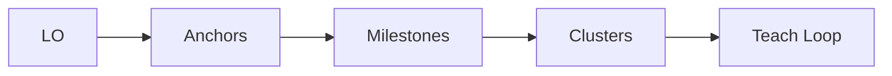

# Runtime Bundle: 04_LOGGING_AND_TEMPLATES.md
Version: v9.5
Generated by: sop/tools/build_runtime_bundle.py (deterministic)
Sources:
- sop/library/08-logging.md
- sop/library/09-templates.md

---

## Runtime Additions (v9.3)

### Topic Prefix (multi-domain)
- `topic` must start with `[DPT]`, `[Startup]`, or `[Other]`.

### Dashboard `anki_cards` Encoding
- `anki_cards` remains a semicolon-separated list.
- Each card entry is: `Front|||Back|||TagsCSV|||Deck`.
- Avoid semicolons inside Front/Back.
- Deck may be `AUTO` to route by topic prefix.

## Source: sop/library/08-logging.md

# Logging Schema v9.4 (Canonical)

## Purpose

Single, consistent logging format for all study sessions. This file is the **schema reference**.

## Critical Rules

1. **No Phantom Outputs** (invariant): never invent, backfill, or hallucinate data. If a value wasn't captured, use the empty-value convention below.
2. **JSON is produced post-session** via Brain ingestion prompts (see `10-deployment.md`), NOT by the tutor at Wrap.
3. **Empty-value convention:**
   - Session Ledger (plain text at Wrap): use `NONE`
   - JSON (produced via Brain ingestion): use `"N/A"` for text fields, `null` for numeric fields

---

## Formatting Rules (JSON)

- Dates: `YYYY-MM-DD`
- Multi-item text fields: semicolon-separated
- No multiline strings; one line per value
- Numeric fields use numbers (duration_min, ratings, percentages)
- Field names are fixed; update downstream tools before changing keys

---

## Session Ledger (Produced at Wrap)

The tutor outputs this plain-text ledger at Wrap. It is the input for Brain ingestion.

```
session_date: YYYY-MM-DD
covered: [semicolon-separated list of what was actually studied]
not_covered: [semicolon-separated list of planned but not reached]
weak_anchors: [semicolon-separated list of items needing review]
artifacts_created: [semicolon-separated list — only if actually created]
timebox_min: [number — actual session duration]
method_chain: [method chain used during session (from composable method library); NONE if not used]
```

Empty fields: use `NONE` (see Critical Rules above for JSON convention).

---

## Tracker JSON (Schema Reference — produced via Brain ingestion, not at Wrap)

```json
{
  "schema_version": "9.4",
  "date": "YYYY-MM-DD",
  "topic": "Main topic",
  "mode": "Core",
  "duration_min": 45,
  "understanding": 4,
  "retention": 4,
  "calibration_gap": 10,
  "rsr_percent": 70,
  "cognitive_load": "intrinsic",
  "transfer_check": "yes",
  "anchors": "semicolon-separated",
  "what_worked": "semicolon-separated",
  "what_needs_fixing": "semicolon-separated",
  "error_classification": "semicolon-separated",
  "error_severity": "semicolon-separated",
  "error_recurrence": "semicolon-separated",
  "notes": "semicolon-separated"
}
```

---

## Enhanced JSON (Schema Reference — produced via Brain ingestion, not at Wrap)

Includes all Tracker fields plus:

| Field | Format |
|-------|--------|
| `source_lock` | semicolon-separated |
| `plan_of_attack` | semicolon-separated |
| `frameworks_used` | semicolon-separated |
| `buckets` | semicolon-separated |
| `confusables_interleaved` | semicolon-separated |
| `anki_cards` | semicolon-separated |
| `glossary` | semicolon-separated |
| `exit_ticket_blurt` | semicolon-separated |
| `exit_ticket_muddiest` | semicolon-separated |
| `exit_ticket_next_action` | semicolon-separated |
| `retrospective_status` | semicolon-separated |
| `spaced_reviews` | `R1=YYYY-MM-DD; R2=YYYY-MM-DD; R3=YYYY-MM-DD; R4=YYYY-MM-DD` |
| `next_session` | semicolon-separated |
| `errors_by_type` | `careless=N; misunderstanding=N; spacing=N; transfer=N` |
| `errors_by_severity` | `minor=N; moderate=N; critical=N` |
| `error_patterns` | semicolon-separated descriptions |
| `spacing_algorithm` | `standard` or `rsr-adaptive` |
| `rsr_adaptive_adjustment` | e.g., `R2 extended +25% to 3.75d; RSR=85%` |
| `adaptive_multipliers` | e.g., `R2=1.25; R3=1.0` |

Rule: anki_cards is recorded only if cards were actually created; otherwise set to NONE (never invent cards).

---

## Metric Definitions

### Calibration Gap
Predicted performance (JOL) minus actual recall. Positive = overconfident, negative = underconfident, zero = accurate.

### RSR (Retrieval Success Rate)
Percent correct on recall attempts at session start (0-100).

### Cognitive Load Type
Dominant load during session. One of: `intrinsic` | `extraneous` | `germane`.

### Transfer Check
Did you connect this session's content to another class? `yes` | `no`.

---

## Error Classification Schema

### Enums

| Field | Values |
|-------|--------|
| Error type | `careless` &#124; `misunderstanding` &#124; `spacing` &#124; `transfer` |
| Error severity | `minor` &#124; `moderate` &#124; `critical` |

### Field Definitions

- `error_classification`: Types observed this session (e.g., `"misunderstanding; spacing"`)
- `error_severity`: Severity matching classification order (e.g., `"moderate; minor"`)
- `error_recurrence`: Count of previous sessions each error appeared (e.g., `"3; 1"`)
- `errors_by_type` (Enhanced): Aggregate counts per type
- `errors_by_severity` (Enhanced): Aggregate counts per severity
- `error_patterns` (Enhanced): Recurring error descriptions (e.g., `"origin vs insertion confusion recurring 3 sessions"`)

---

## Metrics Fill-In Template

Copy and fill after each session:

```
Calibration gap: [e.g., +10 overconfident, -5 underconfident, 0 accurate]
Retrieval success rate: [0-100%]
Cognitive load type: [intrinsic/extraneous/germane]
Transfer check: [yes/no]
Notes: [short, semicolon-separated if used in JSON]
```

---

## Output Flow

1. **At Wrap:** tutor outputs Exit Ticket + Session Ledger (plain text). Template in `Templates section` §4.
2. **Post-session:** Brain ingestion prompts (see `10-deployment.md`) produce JSON (Tracker + Enhanced).
3. Use current system date for the `date` field.

---

## Exit Ticket (Final 10 Minutes)

1. **Free recall blurt** (2 min, notes closed)
2. **Muddiest point** (one concept)
3. **Next action hook** (first action for next session)

---

## Dashboard Table

| Date | Topic | Mode | Duration | RSR % | Cal Gap | Load | Transfer | Muddiest | Next Action | Error Type | Severity | Recurrence |
|------|-------|------|----------|-------|---------|------|----------|----------|-------------|------------|----------|------------|
| YYYY-MM-DD | [topic] | Core/Sprint/Drill | [min] | 0-100 | +/- | I/E/G | Y/N | [concept] | [action] | [type] | [sev] | [count] |

---

## Appendix: Schema Changelog

### v9.3 → v9.4
- Wrap outputs reduced to Exit Ticket + Session Ledger only (Lite Wrap).
- JSON moved to Brain ingestion post-session.
- Added Session Ledger format.
- No Phantom Outputs invariant enforced.
- Spacing/review scheduling removed from Wrap.
- Topic prefix requirement removed.

### v9.2 → v9.3
- Removed: `system_performance`, `wrap_watchlist`, `exit_ticket_zeigarnik`, `runtime_notes`.
- Renamed: `retrieval_success_rate` → `rsr_percent`.
- Added (Tracker): `error_classification`, `error_severity`, `error_recurrence`.
- Added (Enhanced): `confusables_interleaved`, `errors_by_type`, `errors_by_severity`, `error_patterns`, `spacing_algorithm`, `rsr_adaptive_adjustment`, `adaptive_multipliers`.
- Changed: `spaced_reviews` format `Review1=` → `R1=`.

## Source: sop/library/09-templates.md

# 09 — Templates

All PEIRRO study templates in one file. Copy and fill in per session/week.

---

## 1. Session Intake

**Exposure Check:** First exposure / Review (circle one)

### Track A (First Exposure)
- Class/topic:
- Time available:
- Input materials (paste or upload):
- [ ] AI cluster map approved
- Plan from map (3-5 steps):
- Prime (brain dump; UNKNOWN is valid):
- Mode (Core/Sprint/Light/Quick Sprint/Drill):
- Method chain (optional):

### Track B (Review)
- Target exam/block:
- Time available:
- Topic scope:
- Materials (Source-Lock):
- Weak anchors to interleave:
- Plan of attack (3-5 steps):
- Pre-test (1-3 retrieval items, no hints):
- Mode (Core/Sprint/Light/Quick Sprint/Drill):
- Method chain (optional):

---

## 2. Session Log

JSON is the canonical log format (see `08-logging.md`). Use this template for quick human-readable recaps.

- Date:
- Topic:
- Mode:
- Duration (min):

**Anchors Locked:**
-

**Cards Created:**
-

**Metrics:**
- Calibration gap:
- Retrieval success rate:
- Cognitive load type:
- Transfer check:

**Exit Ticket:**
- Blurt summary:
- Muddiest point:
- Next action hook:

**Next Session** (topic + date):
-

---

## 3. LO Engine Topic Note Template

Obsidian-ready, fixed output order. Use one LO at a time.

1) LO text:
- LO:

2) Source anchors (file + slide/page/heading):
- [source]:

3) Milestone Map (3-7 milestones per LO, each with anchor):
- M1: [milestone] (anchor)
- M2: [milestone] (anchor)
- M3: [milestone] (anchor)

4) Cluster Map (3-5 clusters mapped to LO):
- C1: [cluster] -> LO [id]
- C2: [cluster] -> LO [id]
- C3: [cluster] -> LO [id]

5) Explanation per cluster (plain language):
- C1:
- C2:
- C3:

6) Mermaid diagram (big-picture spine + clusters):


7) Retrieval prompts (2-3 per cluster; free recall):
- C1:
  - Prompt 1:
  - Prompt 2:
- C2:
  - Prompt 1:
  - Prompt 2:
- C3:
  - Prompt 1:
  - Prompt 2:

8) Transfer prompt (1 per LO):
- Transfer:

9) Next micro-task (<=15 words):
- Next:

---

## 4. Exit Ticket + Session Ledger (Wrap Outputs — v9.4)

**Exit Ticket:**
- [ ] **Blurt** (2 min, notes closed) — free recall summary: _______________
- [ ] **Muddiest point** — one concept: _______________
- [ ] **Next action hook** — first action next session: _______________

**Session Ledger:**
- session_date: _______________
- covered: _______________
- not_covered: _______________
- weak_anchors: _______________
- artifacts_created: _______________
- timebox_min: _______________
- method_chain: _______________

**Rules:**
- Only list what actually happened. If a field has nothing, write `NONE`.
- No JSON at Wrap.
- JSON is produced post-session via Brain ingestion (see `10-deployment.md`).
- No spacing schedule at Wrap. Spacing is a Planner/Dashboard/Calendar responsibility.
- Zeigarnik is not used as a memory guarantee; next-action hook is a friction reducer.

---

## 5. Weekly Plan (3+2 Clusters)

**Cluster A (technical):**
- [ ]
- [ ]
- [ ]

**Cluster B (light/reading):**
- [ ]
- [ ]

**Weekly Rhythm:**
- Mon/Wed/Fri: Deep work Cluster A + 15 min review Cluster B
- Tue/Thu/Sat: Deep work Cluster B + 15 min review Cluster A
- Sun: Weekly review + metacognition

**Notes:**
- [ ] Cross-review targets:
- [ ] Known weak anchors to revisit:

---

## 6. Weekly Review (Sunday)

**Wins:**
- [ ]

**Gaps / Friction:**
- [ ]

**Backlog (carry-forward):**
- [ ]

**Load Check:**
- Intrinsic:
- Extraneous:
- Germane:

**Next Week Plan:**
- Cluster A (technical):
- Cluster B (light/reading):
- Priority topics:

---

## 7. Retrospective Timetable (1-3-7-21)

Spacing logic and RSR-adaptive adjustments in `07-workload.md`.

**Status:** Red = struggled (review sooner) | Yellow = effortful success (keep spacing) | Green = easy (extend interval)

| Item | +1d | Status | +3d | Status | +7d | Status | +21d | Status | Notes |
|------|-----|--------|-----|--------|-----|--------|------|--------|-------|
| [Concept] | YYYY-MM-DD | R/Y/G | YYYY-MM-DD | R/Y/G | YYYY-MM-DD | R/Y/G | YYYY-MM-DD | R/Y/G | |

**CSV variant:**
```
Item,Review1,Status1,Review2,Status2,Review3,Status3,Review4,Status4,Notes
[Concept],YYYY-MM-DD,R/Y/G,YYYY-MM-DD,R/Y/G,YYYY-MM-DD,R/Y/G,YYYY-MM-DD,R/Y/G,[notes]
```

---

## 8. Progress Tracker

**Status legend:**
- **Not started:** No active session yet
- **In progress:** Learned once but retrieval is weak
- **Needs review:** Learned but failed recent retrieval
- **Solid:** Successful retrieval on two separate sessions

| Module | Topic / LO | Status | Last Date | Next Action | Next Review | Source-Lock | Notes |
|--------|-----------|--------|-----------|-------------|-------------|-------------|-------|
| M3 | LO 2.1: Shoulder stabilizers | In progress | YYYY-MM-DD | Drill rotator cuff actions | YYYY-MM-DD | Slides 12-18 | Missed supraspinatus action |

**Update cadence:** Update post-session via Planner/Dashboard. Use the Session Ledger's `weak_anchors` and exit ticket "Next action" to inform updates. Review dates are set by the Planner, not at Wrap.

---

## 9. Post-Lecture Elaboration Prompts

Use within 24 hours. Answer from memory first, then check sources.

**Why/How:**
- Why does this step happen first?
- How does this structure create the observed outcome?
- What would change if one component failed?

**Compare/Contrast:**
- How is A different from B?
- Where do they overlap and diverge?

**Predict/Apply:**
- If X increases/decreases, what happens to Y?
- Given a new case, how would the mechanism change?

**Teach-Back:**
- Explain the concept in 3 sentences.
- Explain it to a 10-year-old (L2).

**Error Check:**
- What did I get wrong in the session?
- What is the corrected version?
